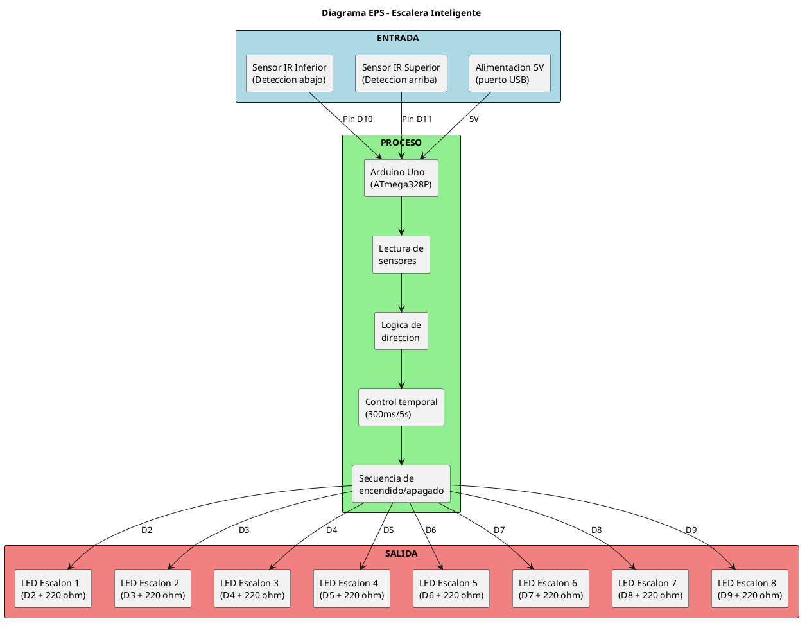

# Circuito

## Esquema de Conexiones

### LEDs (Escalones 1-8)

| Escalón | Pin Arduino | Conexión |
|---------|-------------|----------|
| 1 (abajo) | D2 | Pin → 220 ohm → LED → GND |
| 2 | D3 | Pin → 220 ohm → LED → GND |
| 3 | D4 | Pin → 220 ohm → LED → GND |
| 4 | D5 | Pin → 220 ohm → LED → GND |
| 5 | D6 | Pin → 220 ohm → LED → GND |
| 6 | D7 | Pin → 220 ohm → LED → GND |
| 7 | D8 | Pin → 220 ohm → LED → GND |
| 8 (arriba) | D9 | Pin → 220 ohm → LED → GND |

### Sensores IR

| Componente | Pin Arduino | Conexión |
|------------|-------------|----------|
| Emisor IR inferior | — | 5V → 100 ohm → Ánodo IR → Cátodo IR → GND |
| Receptor IR inferior | D10 | 5V → 10k ohm → Colector, Emisor → GND, pin digital en Colector |
| Emisor IR superior | — | 5V → 100 ohm → Ánodo IR → Cátodo IR → GND |
| Receptor IR superior | D11 | 5V → 10k ohm → Colector, Emisor → GND, pin digital en Colector |

## Resistencias

- **220 ohm** (marron-rojo-marron): Limitador de corriente para LEDs blancos
- **100 ohm** (marron-negro-marron): Limitador de corriente para LEDs IR emisores
- **10k ohm** (marron-negro-naranja): Pull-up para fototransistores receptores

## Alimentacion

El Arduino se alimenta exclusivamente por puerto USB. Todos los componentes
reciben 5V desde los pines del Arduino.

## Diagrama EPS

