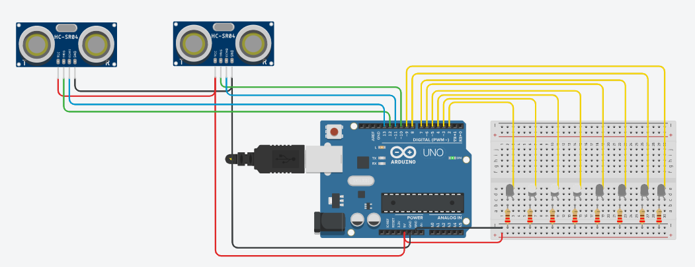

# Escalera Inteligente

Maqueta de escaleras con iluminación LED inteligente controlada por **Arduino Uno**.

## Descripción del Proyecto

Sistema de iluminación automática para escaleras que detecta la posición de personas
mediante **2 sensores de ultrasonido HC-SR04** y enciende los LEDs de forma dinámica:
el sensor inferior ilumina progresivamente durante el acercamiento, y el sensor
superior sigue a la persona con un foco de 3 LEDs mientras sube o baja.

---

## 🌐 Simulación Interactiva en Tinkercad

El circuito y la lógica de control están disponibles para su ejecución y prueba interactiva en Tinkercad:

🔗 **[Abrir Simulación en Tinkercad](https://www.tinkercad.com/things/0pheYHJu6yR-lus-escaleras-arduino/editel?returnTo=https%3A%2F%2Fwww.tinkercad.com%2Fdashboard&sharecode=S3InYTMaIszsQmBVlUAJu1_tCbUvaevH3J8RIkOQQLU)**

---

## Componentes del Hardware

| Cantidad | Componente | Función | Conexión Arduino |
|:--------:|------------|---------|------------------|
| 1 | **Arduino Uno** | Microcontrolador principal | Puerto USB (Alimentación 5V) |
| 8 | **LED blanco** | Iluminación de cada escalón (1 a 8) | Pines D2 a D9 |
| 8 | **Resistencia 220 Ω** | Limitación de corriente para LEDs | En serie con ánodo de los LEDs |
| 2 | **Sensor Ultrasonido HC-SR04** | Medición de distancia de la persona | Superior Trig/Echo D10/D11, Inferior Trig/Echo D12/D13 |
| — | **Cables Jumper y Protoboard** | Interconexiones del circuito | — |

---

## Comportamiento del Sistema

### 🚶 Acercamiento (Sensor Inferior, 0-20 cm)
1. El sensor inferior apunta hacia afuera de la escalera y detecta la persona.
2. Mientras la persona se acerca, los LEDs se encienden progresivamente desde abajo.
3. A menor distancia, mayor número de escalones iluminados.

### 🧗 En la Escalera (Sensor Superior, 5-50 cm)
1. El sensor superior apunta hacia abajo de la escalera y mide la distancia.
2. La distancia se mapea a la posición del escalón (5 cm → escalón 8, 50 cm → escalón 1).
3. Un **foco de 3 LEDs** sigue a la persona en tiempo real mientras sube o baja.
4. Los escalones detrás de la persona se apagan y los de adelante se encienden.

### ⏱️ Sin Contacto
Si el sensor superior pierde la señal durante **2 segundos**, todos los LEDs se
apagan y el sistema vuelve al estado de espera.

---

## Guía de Documentación y Diagramas

- 📐 **[Esquema de Circuito y Conexiones](circuito.md):** Tabla completa de pines, resistencias y Diagrama EPS.
- ⚙️ **[Lógica del Programa y Diagramas](logica.md):** Máquina de estados finitos, Diagrama de Flujo y Diagrama de Procesos.

---

## Licencia

Este proyecto se distribuye bajo la licencia [MIT](../LICENSE).