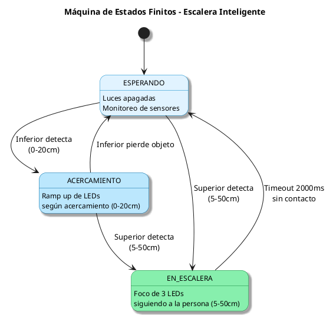
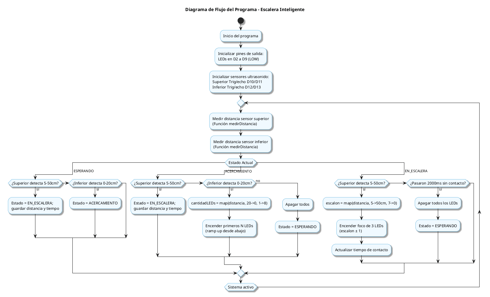
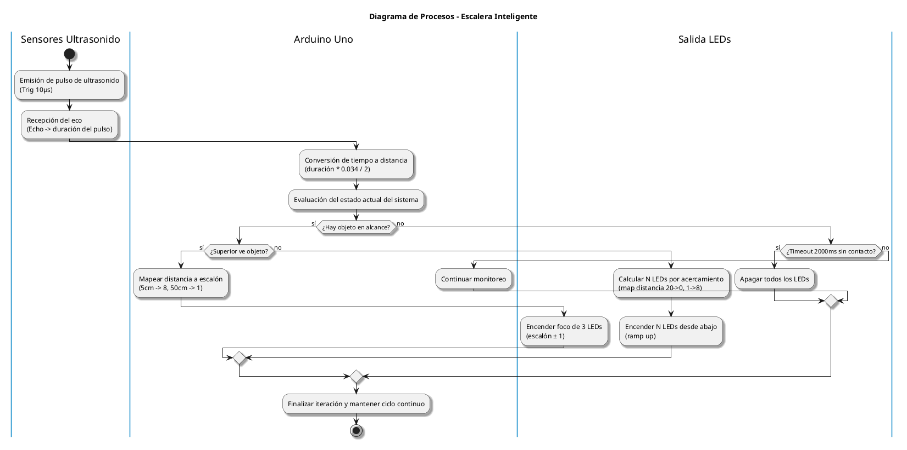

# Lógica del Programa

El sistema de control de la escalera inteligente está diseñado mediante una **máquina de estados finitos** implementada en C++ para Arduino. La lógica es dinámica: las luces responden en tiempo real a la posición de la persona medida por los sensores de ultrasonido HC-SR04.

---

## 1. Máquina de Estados Finitos

El programa consta de **3 estados principales** que controlan el flujo de operación de la escalera:



| Nombre del Estado | Descripción del Comportamiento |
|-------------------|--------------------------------|
| `ESPERANDO` | **Reposo:** Luces apagadas, monitoreo constante de sensores. |
| `ACERCAMIENTO` | El sensor inferior (0-20 cm) ilumina LEDs progresivamente mientras la persona se acerca. |
| `EN_ESCALERA` | El sensor superior (5-50 cm) mapea la distancia a un escalón y enciende un **foco de 3 LEDs** que sigue a la persona. |

### Transiciones

```
ESPERANDO ──(inferior detecta 0-20cm)──▶ ACERCAMIENTO ──(superior detecta 5-50cm)──▶ EN_ESCALERA
   ▲                                                                                  │
   └──────────────────────(sin contacto > 2s)──────────────────────────────────────────┘
```

- Si el sensor superior ve un objeto, tiene prioridad y pasa directo a `EN_ESCALERA`.
- La transición de regreso a `ESPERANDO` ocurre tras 2 segundos sin contacto con el sensor superior.

---

## 2. Diagrama de Flujo del Programa

Muestra la lógica de decisiones que toma el programa en cada iteración del bucle `loop()`:



---

## 3. Diagrama de Procesos

Describe la interacción entre el hardware físico (sensores), el microcontrolador Arduino y las salidas digitales (LEDs):



---

## 4. Conceptos Clave de Implementación

### Medición de Distancia (`medirDistancia`)
Función estándar para HC-SR04: emite pulso de trig (10 µs), mide el ancho del pulso de echo con `pulseIn()` y convierte a centímetros:
```cpp
long duracion = pulseIn(pinEcho, HIGH, 30000);
if (duracion == 0) return -1.0;      // sin eco (objeto fuera de rango)
return duracion * 0.034 / 2.0;       // cm
```
Si no hay eco en 30 ms, se devuelve `-1` para ignorar la lectura.

### Ramp Up por Acercamiento (sensor inferior)
Mientras la persona se acerca (distancia de 20 cm a 0 cm), aumenta el número de LEDs encendidos desde la parte baja:
```cpp
int cantidadLEDs = map(distanciaInferior, 20, 0, 1, 8);
cantidadLEDs = constrain(cantidadLEDs, 1, 8);
```

### Mapeo distancia → escalón (sensor superior)
La distancia se convierte en el escalón donde se encuentra la persona:
```cpp
int escalonActual = map(distanciaSuperior, 5, 50, 7, 0);  // 5cm=arriba, 50cm=abajo
escalonActual = constrain(escalonActual, 0, 7);
```

### Foco de 3 LEDs
Se encienden el escalón actual más sus vecinos (radio = 1); el resto quedan apagados, por lo que las luces **siguen** a la persona en ambas direcciones:
```cpp
void encenderFoco(int centro, int radio) {
  for (int i = 0; i < CANTIDAD_LEDS; i++) {
    bool activar = (i >= centro - radio && i <= centro + radio);
    digitalWrite(PINES_LEDS[i], activar ? HIGH : LOW);
  }
}
```

### Timeout sin contacto
Si el sensor superior no detecta objeto durante 2 s, el sistema apaga todo y vuelve a `ESPERANDO`.

---

## 5. Parámetros del Sistema

- **Alcance inferior (`DIST_INFERIOR_MAX`):** 20 cm.
- **Alcance superior (`DIST_SUPERIOR_MIN`/`MAX`):** 5 a 50 cm.
- **Timeout sin contacto (`TIEMPO_SIN_CONTACTO_MAX`):** 2000 ms.